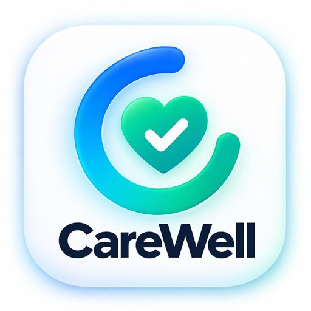

  

  <h1>💊 CareWell</h1>
  
<strong>Next-Generation Healthcare Companion: Smart Medicine Scheduling, Emergency Dispatch & Caregiver Monitoring</strong>

  

    
    
    
    
  

<h3>📌 Overview</h3>

  <strong>CareWell</strong> is an intelligent, responsive healthcare management application designed to bridge the gap between patients, their medical routines, and emergency caregivers. From accurate time-based dosage reminders to instantaneous multi-channel SOS emergency broadcasts, CareWell keeps patients safe and caregivers informed around the clock.

<h3>✨ Key Features</h3>
<ul>
  <li><strong>Smart Dosage & Medicine Tracker:</strong> Digital clock scheduling with actionable floating notifications to mark medications as <em>Taken</em>, <em>Snoozed</em>, or <em>Dismissed</em>.</li>
  <li><strong>One-Tap Instant SOS Emergency:</strong> Live browser geolocation broadcast paired with automated voice calls and transactional SMS dispatch via Twilio.</li>
  <li><strong>WhatsApp Emergency Fallback:</strong> Instant one-click pre-filled emergency chat alert with pinpoint Google Maps coordinates.</li>
  <li><strong>Secure Cloud Sync with Supabase:</strong> User authentication, encrypted profiles, and persistent real-time database tracking for medicine schedules.</li>
  <li><strong>Installable Progressive Web App (PWA):</strong> Add directly to Android, iOS, or Desktop home screens with standalone offline-ready capabilities and native app branding.</li>
</ul>

<h3>🛠️ Tech Stack</h3>
<table align="center" width="100%">
  <thead>
    <tr>
      <th>Layer</th>
      <th>Technologies</th>
    </tr>
  </thead>
  <tbody>
    <tr>
      <td><strong>Frontend</strong></td>
      <td>React, Modern CSS Animations, Progressive Web App (PWA) Manifest</td>
    </tr>
    <tr>
      <td><strong>Backend & APIs</strong></td>
      <td>Next.js API Routes, Geolocation API</td>
    </tr>
    <tr>
      <td><strong>Database & Auth</strong></td>
      <td>Supabase (PostgreSQL, Row Level Security, Auth Engine)</td>
    </tr>
    <tr>
      <td><strong>Telephony & Alerts</strong></td>
      <td>Twilio Programmable Voice & Messaging APIs</td>
    </tr>
  </tbody>
</table>
